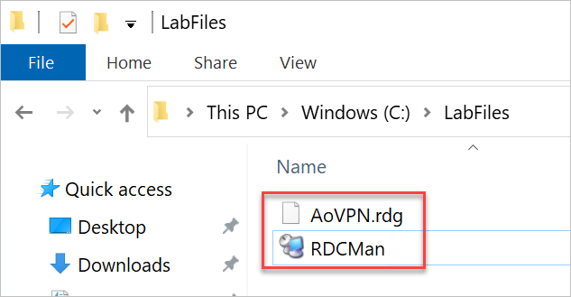
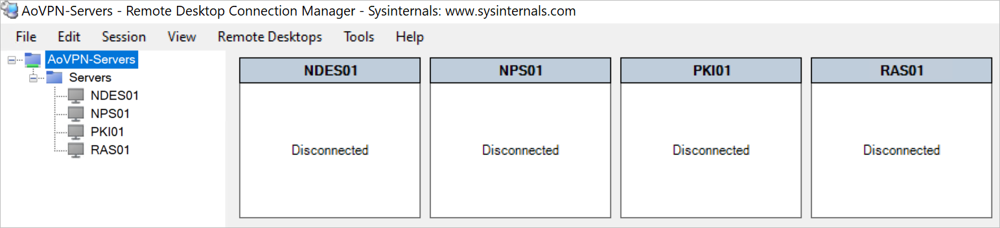

# Deploy Always On VPN - Set up infrastructure for Always On VPN

**Configure Remote Desktop Connection Manager**

As the very first task, Let us setup Remote Desktop Connection Manager so that we can RDP into all the Lab Servers (VMs).

> The Lab VM you are connected to, is the Domain Controller VM that we will be using throughout the Lab to connect to other VMs

- Download RDC Manager from this link in your Lab VM: <u>https://experienceazure.blob.core.windows.net/templates/always-on-vpn/labfiles/RDCMan.exe</u>

- Save the Downloaded File in **C:\LabFiles**

- Download RDC Manager Config file (AoVPN.rdg) from this link in your Lab VM: <u>https://experienceazure.blob.core.windows.net/templates/always-on-vpn/labfiles/AoVPN.rdg</u>

- Save the Downloaded File in **C:\LabFiles**

- Launch the **RDC Manager**

- Click **File** and then **Open**:

- Navigate to **C:\LabFiles** and locate the **AOVPN.rdg** file, Open the File in RDC Manager.

- The Connection objects to the Lab Servers will open.

- Login to Azure by following the Instructions from Page No. 1 and use the below credentials:

  - Email/Username: <inject key="AzureAdUserEmail"></inject>
  - Password: <inject key="AzureAdUserPassword"></inject>

- Verify Azure Setup

- Note the Private IP Addresses assigned to the Lab Servers:

        | VMName | Private IP |
        |--------|------------|
        | DC01   | 10.0.0.4   |
        | PKI01  | 10.0.0.5   |
        | NPS01  | 10.0.0.6   |
        | RAS01  | 10.0.0.7   |
        | NDES01 | 10.0.0.8   |