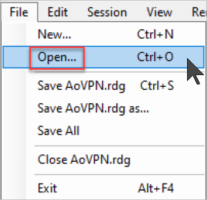
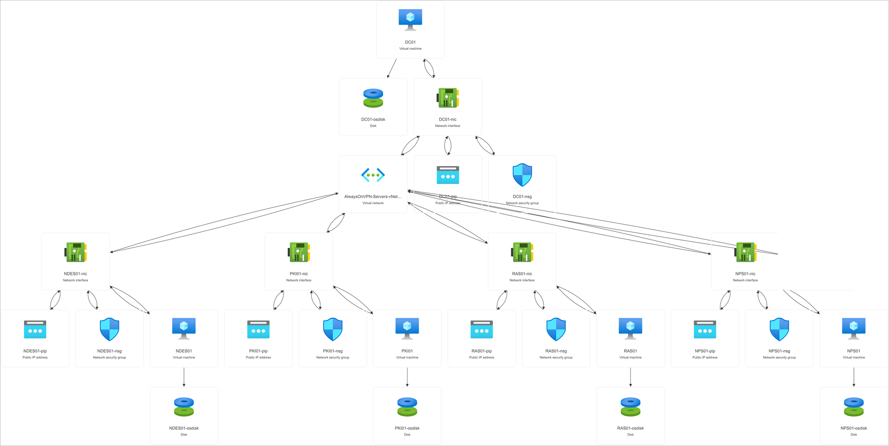
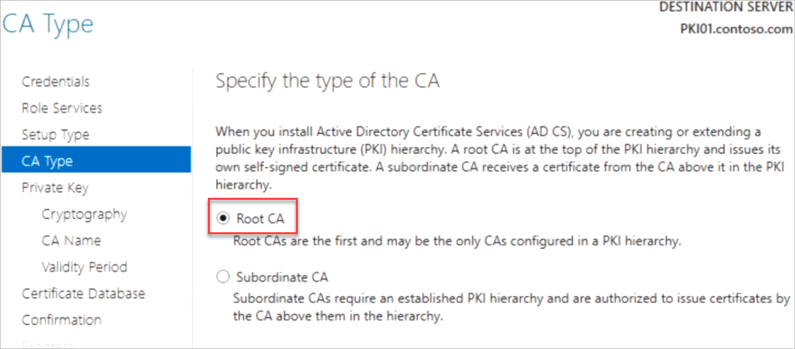
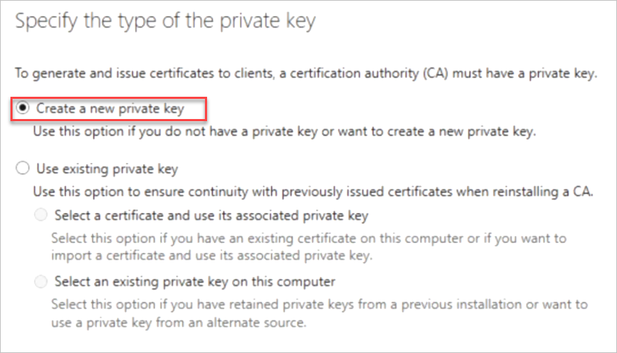
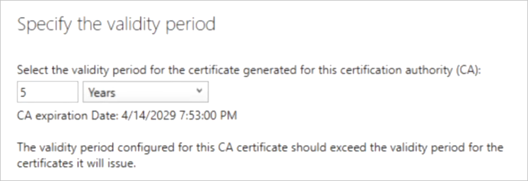

# Deploy Always On VPN - Set up infrastructure for Always On VPN

**Configure Remote Desktop Connection Manager**

As the very first task, Let us setup Remote Desktop Connection Manager so that we can RDP into all the Lab Servers (VMs).

> The Lab VM you are connected to, is the Domain Controller VM that we will be using throughout the Lab to connect to other VMs

- Download RDC Manager from this link in your Lab VM: <u>https://experienceazure.blob.core.windows.net/templates/always-on-vpn/labfiles/RDCMan.exe</u>

- Save the Downloaded File in **C:\LabFiles**

- Download RDC Manager Config file (AoVPN.rdg) from this link in your Lab VM: <u>https://experienceazure.blob.core.windows.net/templates/always-on-vpn/labfiles/AoVPN.rdg</u>

- Save the Downloaded File in **C:\LabFiles**

- Launch the **RDC Manager**

- Click **File** and then **Open**:

- Navigate to **C:\LabFiles** and locate the **AOVPN.rdg** file, Open the File in RDC Manager.

- The Connection objects to the Lab Servers will open.

- Login to Azure by following the Instructions from Page No. 1 and use the below credentials:

  - Email/Username: <inject key="AzureAdUserEmail"></inject>
  - Password: <inject key="AzureAdUserPassword"></inject>

- Verify Azure Setup

- Note the Private IP Addresses assigned to the Lab Servers:

        | VMName | Private IP |
        |--------|------------|
        | DC01   | 10.0.0.4   |
        | PKI01  | 10.0.0.5   |
        | NPS01  | 10.0.0.6   |
        | RAS01  | 10.0.0.7   |
        | NDES01 | 10.0.0.8   |

# Lab 1 - Set up infrastructure for Always On VPN

In this tutorial, you'll learn how to deploy Always On VPN connections for remote domain-joined Windows client computers. You'll create a sample infrastructure that shows you how to implement an Always On VPN connection process. The process is composed of the following steps:

1. The Windows VPN client uses a public DNS server to perform a name resolution query for the IP address of the VPN gateway.

2. The VPN client uses the IP address returned by DNS to send a connection request to the VPN gateway.

3. The VPN server is also configured as a Remote Authentication Dial-In User Service (RADIUS) Client; the VPN RADIUS Client sends the connection request to the NPS server for connection request processing.

4. The NPS server processes the connection request, including performing authorization and authentication, and determines whether to allow or deny the connection request.

5. The NPS server forwards an Access-Accept or Access-Deny response to the VPN server.

6. The connection is initiated or terminated based on the response that the VPN server received from the NPS server.

**Prerequisites**

To complete the steps in this tutorial,

- You'll need access to four physical computers or virtual machines (VMs).

- Ensure that your user account on all machines is a member of **Administrators**, or equivalent.

**Important**

*Using Remote Access in Microsoft Azure is not supported, including both Remote Access VPN and DirectAccess. For more information, see* [<u>Microsoft server software support for Microsoft Azure virtual machines</u>](https://support.microsoft.com/help/2721672/microsoft-server-software-support-for-microsoft-azure-virtual-machines)*.*

**Step 1: Create the domain controller**

This step is already performed by CloudLabs Automation to save time.

**Step 2: Create an Active Directory Group Policy**

In this section, you'll create a Group Policy on the domain controller so that domain members automatically request user and computer certificates. This configuration lets VPN users request and retrieve user certificates that automatically authenticate VPN connections. This policy also allows the NPS server to request server authentication certificates automatically.

**Important: These steps are to be performed on DC01**

1. On the domain controller, open Group Policy Management.

    1. Open the **RUN** prompt and type **GPMC.MSC**

    

2. In the left pane, right-click your domain (for example, corp.contoso.com). Select **Create a GPO in this domain, and Link it here**.

3. On the New GPO dialog box, for **Name**, enter *Autoenrollment Policy*. Select **OK**.

4. In the left pane, right-click **Autoenrollment Policy**. Select **Edit** to open the **Group Policy Management Editor**.

5. In the **Group Policy Management Editor**, complete the following steps to configure computer certificate autoenrollment:

    1. In the left pane, go to **Computer Configuration** \> **Policies** \> **Windows Settings** \> **Security Settings** \> **Public Key Policies**.

    2. In the details pane, right-click **Certificate Services Client – Auto-Enrollment**. Select **Properties**.

    

    3. On the **Certificate Services Client – Auto-Enrollment Properties** dialog box, for **Configuration Model**, select *Enabled*.

    4. Select **Renew expired certificates, update pending certificates, and remove revoked certificates** and **Update certificates that use certificate templates**.

    

    5. Select **OK**.

6. In the **Group Policy Management Editor**, complete the following steps to Configure user certificate autoenrollment:

    1. In the left pane, go to **User Configuration** \> **Policies** \> **Windows Settings** \> **Security Settings** \> **Public Key Policies**.

    2. In the details pane, right-click **Certificate Services Client – Auto-Enrollment** and select **Properties**.

    

    3. On the **Certificate Services Client – Auto-Enrollment Properties** dialog box, in **Configuration Model**, select *Enabled*.

    4. Select **Renew expired certificates, update pending certificates, and remove revoked certificates** and **Update certificates that use certificate templates**.

    

    5. Select **OK**.

    6. Close the Group Policy Management Editor.

Once everything is done, the Group Policy Management should look like below:

7. Close Group Policy Management.

**Step 3: Configure Certificate Authority**

**Important: These steps are to be performed on PKI01**

1. Log on as a member of both the Enterprise Admins group and the root domain's Domain Admins group.

    - Use RDC Man to connect to PKI01 Server
    - Use the below credentials:

        - Admin Username: <inject key="Admin Username"></inject>
        - Admin Password: <inject key="Admin Password"></inject>

2. In Server Manager, click **Manage**, and then click **Add Roles and Features**. The Add Roles and Features Wizard opens.

3. In **Before You Begin**, click **Next**.

4. In **Select Installation Type**, ensure that **Role-Based or feature-based installation** is selected, and then click **Next**.

5. In **Select destination server**, ensure that **Select a server from the server pool** is selected. In **Server Pool**, ensure that the local computer is selected. Click **Next**.

6. In **Select Server Roles**, in **Roles**, select **Active Directory Certificate Services**. When you are prompted to add required features, click **Add Features**, and then click **Next**.

7. In **Select features**, click **Next**.

8. In **Active Directory Certificate Services**, read the provided information, and then click **Next**.

9. In **Role Services**, click **Certification Authority**, click **Certification Authority Web Enrollment**, and then click **Next**.

10. In **Confirm installation selections**, click **Install**. Do not close the wizard during the installation process. When installation is complete, click **Configure Active Directory Certificate Services on the destination server**. The AD CS Configuration wizard opens. Read the credentials information and, if needed, provide the credentials for an account that is a member of the Enterprise Admins group. Click **Next**.

- In **Role Services**, click **Certification Authority**, click **Certification Authority Web Enrollment**, and then click **Next**.

11. On the **Setup Type** page, verify that **Enterprise CA** is selected, and then click **Next**.

12. On the **Specify the type of the CA** page, verify that **Root CA** is selected, and then click **Next**.

13. On the **Specify the type of the private key** page, verify that **Create a new private key** is selected, and then click **Next**.

14. On the **Cryptography for CA** page, keep the default settings for CSP (**RSA#Microsoft Software Key Storage Provider**) and hash algorithm (**SHA256**), and determine the best key character length for your deployment. Large key character lengths provide optimal security; however, they can impact server performance and might not be compatible with legacy applications. It is recommended that you keep the default setting of 2048. Click **Next**.

15. On the **CA Name** page, keep the suggested common name for the CA or change the name according to your requirements. Ensure that you are certain the CA name is compatible with your naming conventions and purposes, because you cannot change the CA name after you have installed AD CS. Click **Next**.

16. On the **Validity Period** page, in **Specify the validity period**, type the number and select a time value (Years, Months, Weeks, or Days). The default setting of five years is recommended. Click **Next**.

17. On the **CA Database** page, in **Specify the database locations**, specify the folder location for the certificate database and the certificate database log. If you specify locations other than the default locations, ensure that the folders are secured with access control lists (ACLs) that prevent unauthorized users or computers from accessing the CA database and log files. Click **Next**.

18. In **Confirmation**, click **Configure** to apply your selections, and then click **Close**.

**Step 4: Configure NPS Server**

**Important: These steps are to be performed on NPS01**

1. On NPS01, in Server Manager, click **Manage**, and then click **Add Roles and Features**. The Add Roles and Features Wizard opens.

2. In **Before You Begin**, click **Next**.

3. In **Select Installation Type**, ensure that **Role-Based or feature-based installation** is selected, and then click **Next**.

4. In **Select destination server**, ensure that **Select a server from the server pool** is selected. In **Server Pool**, ensure that the local computer is selected. Click **Next**.

5. In **Select Server Roles**, in **Roles**, select **Network Policy and Access Services**. A dialog box opens asking if it should add features that are required for Network Policy and Access Services. Click **Add Features**, and then click **Next**

6. In **Select features**, click **Next**, and in **Network Policy and Access Services**, review the information that is provided, and then click **Next**.

7. In **Select role services**, click **Network Policy Server**. In **Add features that are required for Network Policy Server**, click **Add Features**. Click **Next**.

8. In **Confirm installation selections**, click **Restart the destination server automatically if required**. When you are prompted to confirm this selection, click **Yes**, and then click **Install**. The Installation progress page displays status during the installation process. When the process completes, the message "Installation succeeded on *ComputerName*" is displayed, where *ComputerName* is the name of the computer upon which you installed Network Policy Server. Click **Close**.

9. On the NPS, in Server Manager, click **Tools**, and then click **Network Policy Server**. The Network Policy Server console opens.

10. Right-click **NPS (Local)**, and then click **Register Server in Active Directory**. The **Network Policy Server** dialog box opens.

11. In **Network Policy Server**, click **OK**, and then click **OK** again.

**Step 5: Configure VPN Server**

**Important: These steps are to be performed on RAS01**

1. On the Windows server, in Server Manager, select **Manage** and select **Add Roles and Features** to open the Add Roles and Features Wizard.

2. On the Before you begin page, select **Next**.

3. On the Select Installation Type page, select **Role-Based or feature-based installation** and select **Next**.

4. On the Select destination server page, select **Select a server from the server pool** .

5. Under Server Pool, select the local computer and select **Next**.

6. On the Select server roles page, in **Roles**, select **Remote Access**, then **Next**.

7. On the Select features page, select **Next**.

8. On the Remote Access page, select **Next**.

9. On the Select role service page, in **Role services**, select **DirectAccess and VPN (RAS)**.

10. On the Confirm installation selections page, review your choices, then select **Install**.

11. When the installation is complete, select **Close**.

12. On the VPN server, in Server Manager, select the Notifications flag. You may have to wait a minute or two to see the Notifications flag.

13. In the **Tasks** menu, select **Open the Getting Started Wizard** to open the Configure Remote Access wizard

14. Select *Deploy VPN only* to open the Routing and Remote Access Microsoft Management Console (MMC).

15. Right-click the VPN server, and then select *Configure and Enable Routing and Remote Access* to open the Routing and Remote Access Server Setup Wizard.

16. In the Welcome to the Routing and Remote Access Server Setup Wizard, select **Next**.

17. In **Configuration**, select *Custom Configuration*, and then select **Next**.

18. In **Custom Configuration**, select *VPN access*, and then select **Next** to open the Completing the Routing and Remote Access Server Setup Wizard.

19. Select **Finish** to close the wizard, then select **OK** to close the Routing and Remote Access dialog box.

20. Once the VPN server is running, right-click the VPN server and select **Properties**.

21. Select the **IPv4** tab and do the following steps:

    1. Select **Static address pool**.

    2. Select **Add** to configure an IP address pool.

    3. In **Start IP address**, enter the starting IP address in the range you want to assign to VPN clients.

    4. In **End IP address**, enter the ending IP address in the range you want to assign to VPN clients, or in **Number of addresses**, enter the number of the address you want to make available.

22. Select **OK** to close the Properties dialog.

23. In Properties, select the **Security** tab and then:

    1. Select **Authentication provider** and select **RADIUS Authentication**.

    2. Select **Configure** to open the RADIUS Authentication dialog.

    3. Select **Add** to open the Add RADIUS Server dialog.

        1. In **Server name**, enter the Fully Qualified Domain Name (FQDN) of the NPS server: **NPS01.Contoso.Com**

        2. In **Shared secret**, select **Change** to open the Change Secret dialog box.

        3. In **New secret**, enter a text string: **Password.1!!**

        4. In **Confirm new secret**, enter the same text string, then select **OK**.

        5. Save this secret. You'll need it when you add this VPN server as a RADIUS client later in this tutorial.

    4. Select **OK** to close the Add RADIUS Server dialog.

    5. Select **OK** to close the Radius Authentication dialog.

24. On the VPN server Properties dialog, select **Authentication Methods...**.

25. Select **Allow machine certificate authentication for IKEv2**.

26. Select **OK**.

27. For **Accounting provider**, select *Windows Accounting*.

28. Select **OK** to close the Properties dialog.

29. A dialog will prompt you to restart the server. Select **Yes**.

**Step 6: Create AD Groups for Servers and VPN Users**

**Important: These steps are to be performed on DC01**

**Create the NPS Servers group:**

1. On the domain controller, open Active Directory Users and Computers.

2. Under your domain, right-click **Computers**. Select **New**, then select **Group**.

3. In **Group name**, enter **NPS Servers**, then select **OK**.

4. Right-click **NPS Servers** and select **Properties**.

5. On the **Members** tab of the NPS Servers Properties dialog box, select **Add**.

6. select **Object Types**, select the **Computers** check box, then select **OK**.

7. In **Enter the object names to select**, enter the computer name of the NPS server.

8. Select **OK**.

**Create the VPN Servers group:**

1. On the domain controller, open Active Directory Users and Computers.

2. Under your domain, right-click **Computers**. Select **New**, then select **Group**.

3. In **Group name**, enter **VPN Servers**, then select **OK**.

4. Right-click **VPN Servers** and select **Properties**.

5. On the **Members** tab of the VPN Servers Properties dialog box, select **Add**.

6. select **Object Types**, select the **Computers** check box, then select **OK**.

7. In **Enter the object names to select**, enter the computer name of the VPN server.

8. Select **OK**.

**Create the VPN Users group:**

1. Create a VPN User by taking the following steps:

    1. On the domain controller, open Active Directory Users and Computers.

    2. Under your domain, right-click **Users**. Select **New**. For **User logon name**, enter any logon name. Select **Next**.

    3. Choose a password for the user.

    4. Deselect **User must change password at next logon**. Select **Password never expires**.

    5. Select **Finish**. Keep Active Directory Users and Computers open.

2. Create a VPN User group by taking the following steps:

    1. Under your domain, right-click **Users**. Select **New**, then select **Group**.

    2. In **Group name**, enter **VPN Users**, then select **OK**.

    3. Right-click **VPN Users** and select **Properties**.

    4. On the **Members** tab of the VPN Users Properties dialog box, select **Add**.

    5. On the Select Users dialog box, add the VPN user that you created and select **OK**.

**Step 7: Configure VPN server as a RADIUS client**

**Important: These steps are to be performed on NPS01**

1. In the NPS console, double-click **RADIUS Clients and Servers**.

2. Right-click **RADIUS Clients** and select **New** to open the New RADIUS Client dialog box.

3. Verify that the **Enable this RADIUS client** check box is selected.

4. In **Friendly name**, enter a display name for the VPN server: **RAS01.Contoso.Com**

5. In **Address (IP or DNS)**, enter the IP address or FQDN of the VPN server: **RAS01.Contoso.Com**

    1. If you enter the FQDN, select **Verify** if you want to verify that the name is correct and maps to a valid IP address.

6. In **Shared secret**:

    1. Ensure that **Manual** is selected.

    2. Enter the secret: **Password.1!!**

    3. For **Confirm shared secret**, re-enter the shared secret.

7. Select **OK**. The VPN Server should appear in the list of RADIUS clients configured on the NPS server.

**Step 8: Configure NPS server as a RADIUS server**

**Important: These steps are to be performed on NPS01**

1. In the NPS console, select **NPS(Local)**.

2. In Standard Configuration, ensure that **RADIUS server for Dial-Up or VPN Connections** is selected.

3. Select **Configure VPN or Dial-Up** to open the Configure VPN or Dial-Up wizard.

4. Select *Virtual Private Network (VPN) Connections*, and select **Next**.

5. In Specify Dial-Up or VPN Server, in RADIUS clients, select the name of the VPN server.

6. Select **Next**.

7. In Configure Authentication Methods, complete the following steps:

    1. Clear **Microsoft Encrypted Authentication version 2 (MS-CHAPv2)** .

    2. Select **Extensible Authentication Protocol**.

    3. For **Type**, select **Microsoft: Protected EAP (PEAP)**. Then select **Configure** to open the Edit Protected EAP Properties dialog box.

    4. Select **Remove** to remove the Secured Password (EAP-MSCHAP v2) EAP type.

    5. Select **Add**. The Add EAP dialog box opens.

    6. Select **Smart Card or other certificate**, then select **OK**.

    7. Select **OK** to close Edit Protected EAP Properties.

8. Select **Next**.

9. In Specify User Groups, complete the following steps:

    1. Select **Add**. The Select Users, Computers, Service Accounts, or Groups dialog box opens.

    2. Enter **VPN Users**, then select **OK**.

    3. Select **Next**.

10. On **Specify IP Filters**, select **Next**.

11. On **Specify Encryption Settings**, select **Next**. Do not make any changes.

12. On **Specify a Realm Name**, select **Next**.

13. Select **Finish** to close the wizard.

**Step 8: Deploy Always On VPN - Configure Certificate Authority templates**

**Important: These steps are to be performed on PKI01**

In this part of the Deploy Always On VPN tutorial, you'll create certificate templates and enroll or validate certificates for the Active Directory (AD) groups

You'll create the following templates:

- *User authentication template*. With a user authentication template, you can improve certificate security by selecting upgraded compatibility levels and choosing the Microsoft Platform Crypto Provider. With the Microsoft Platform Crypto Provider, you can use a Trusted Platform Module (TPM) on client computers to secure the certificate. The user template will be configured for auto-enrollment.

- *VPN server authentication template*. With a VPN server authentication template, you'll add the IP Security (IPsec) IKE Intermediate application policy. The IP Security (IPsec) IKE Intermediate application policy determines how the certificate can be used, it can allow the server to filter certificates if more than one certificate is available. Because VPN clients access this server from the public internet, the subject and alternative names are different than the internal server name. As a result, you won't configure the VPN server certificate for auto-enrollment.

- *NPS server authentication template*. With an NPS server authentication template, you'll copy the standard RAS and IAS Servers template, and scope it for your NPS server. The new NPS server template includes the server authentication application policy.

**Create the user authentication template**

1. On the CA server, which in this tutorial is the domain controller, open the Certification Authority snap-in.

2. In the left pane, right-click **Certificate Templates** and select **Manage**.

3. In the Certificate Templates console, right-click **User** and select **Duplicate Template**.

4. In the Properties of New Template dialog box, on the **General** tab, complete the following steps:

    1. In **Template display name**, enter *VPN User Authentication*.

    2. Clear the **Publish certificate in Active Directory** check box.

5. On the **Security** tab, complete the following steps:

    1. Select **Add**.

    2. On the Select Users, Computers, Service Accounts, or Groups dialog, enter **VPN Users**, then select **OK**.

    3. In **Group or user names**, select **VPN Users**.

    4. In **Permissions for VPN Users**, select the **Enroll** and **Autoenroll** check boxes in the **Allow** column.

1. In **Group or user names**, select **Domain Users**, then select **Remove**.

<!-- -->

1. On the **Compatibility** tab, complete the following steps:

    1. In **Certification Authority**, select *Windows Server 2016*.

    2. On the **Resulting changes** dialog, select **OK**.

    3. In **Certificate recipient**, select *Windows 10/Windows Server 2016*.

    4. On the **Resulting changes** dialog, select **OK**.

2. On the **Request Handling** tab, clear **Allow private key to be exported** .

3. On the **Cryptography** tab, complete the following steps:

    1. In **Provider Category**, select **Key Storage Provider**.

    2. Select **Requests must use one of the following providers**.

    3. Select both **Microsoft Platform Crypto Provider** and **Microsoft Software Key Storage Provider**.

4. On the **Subject Name** tab, clear the **Include e-mail name in subject name** and **E-mail name** .

5. Select **OK** to save the VPN User Authentication certificate template.

6. Close the Certificate Templates console.

7. In the left pane of the Certification Authority snap-in, right-click **Certificate Templates**, select **New** and then select **Certificate Template to Issue**.

8. Select **VPN User Authentication**, then select **OK**.

**Create the VPN Server authentication template**

1. n the left pane of the Certification Authority snap-in, right-click **Certificate Templates** and select **Manage** to open the Certificate Templates console.

2. In the Certificate Templates console, right-click **RAS and IAS Server** and select **Duplicate Template**.

1. On the Properties of New Template dialog box, on the **General** tab, in **Template display name**, enter *VPN Server Authentication*.

2. On the **Extensions** tab, complete the following steps:

    1. Select **Application Policies**, then select **Edit**.

    2. In the **Edit Application Policies Extension** dialog, select **Add**.

    3. On the **Add Application Policy** dialog, select **IP security IKE intermediate**, then select **OK**.

    4. Select **OK** to return to the **Properties of New Template** dialog.

3. On the **Security** tab, complete the following steps:

    1. Select **Add**.

    2. On the **Select Users, Computers, Service Accounts, or Groups** dialog, enter **VPN Servers**, then select **OK**.

    3. In **Group or user names**, select **VPN Servers**.

    4. In **Permissions for VPN Servers**, select **Enroll** in the **Allow** column.

    5. In **Group or user names**, select **RAS and IAS Servers**, then select **Remove**.

4. On the **Subject Name** tab, complete the following steps:

    1. Select **Supply in the Request**.

    2. On the **Certificate Templates** warning dialog box, select **OK**.

5. Select **OK** to save the VPN Server certificate template.

6. Close the Certificate Templates console.

7. In the left pane of the Certificate Authority snap-in, right-click **Certificate Templates**. Select **New** and then select **Certificate Template to Issue**.

8. Select **VPN Server Authentication**, then select **OK**.

9. Reboot the VPN server.

**Create the NPS Server authentication template**

1. In the left pane of the Certification Authority snap-in, right-click **Certificate Templates** and select **Manage** to open the Certificate Templates console.

2. In the Certificate Templates console, right-click **RAS and IAS Server** and select **Duplicate Template**.

1. On the Properties of New Template dialog box, on the **General** tab, in **Template display name**, enter *NPS Server Authentication*.

2. On the **Security** tab, complete the following steps:

    1. Select **Add**.

    2. On the **Select Users, Computers, Service Accounts, or Groups** dialog, enter **NPS Servers**, then select **OK**.

    3. In **Group or user names**, select **NPS Servers**.

    4. In **Permissions for NPS Servers**, select **Enroll** in the **Allow** column.

    5. In **Group or user names**, select **RAS and IAS Servers**, then select **Remove**.

3. Select **OK** to save the NPS Server certificate template.

4. Close the Certificate Templates console.

5. In the left pane of the Certificate Authority snap-in, right-click **Certificate Templates**. Select **New** and then select **Certificate Template to Issue**.

6. Select **NPS Server Authentication**, then select **OK**.

**Enroll and validate the VPN server certificate**

**To enroll the VPN server's certificate:**

1. On the VPN server's Start menu, type **certlm.msc** to open the Certificates snap-in, and press ENTER.

2. Right-click **Personal**, select **All Tasks** and then select **Request New Certificate** to start the Certificate Enrollment Wizard.

3. On the Before You Begin page, select **Next**.

4. On the Select Certificate Enrollment Policy page, select **Next**.

5. On the Request Certificates page, select **VPN Server Authentication**.

6. Under the VPN server check box, select **More information is required** to open the Certificate Properties dialog box.

7. Select the **Subject** tab and enter the following information:*In the **Subject name** section:*

    1. For **Type** select *Common Name*.

    2. For **Value**, enter the name of the external domain that clients use to connect to the VPN (for example, vpn.contoso.com).

    3. Select **Add**.

8. Select **OK** to close Certificate Properties.

9. Select **Enroll**.

10. Select **Finish**.

**To validate the VPN server certificate:**

1. In the Certificates snap-in, under **Personal**, select **Certificates**.Your listed certificates should appear in the details pane.

2. Right-click the certificate that has your VPN server's name, and then select **Open**.

3. On the **General** tab, confirm that the date listed under **Valid from** is today's date. If it isn't, you might have selected the wrong certificate.

4. On the **Details** tab, select **Enhanced Key Usage**, and verify that **IP security IKE intermediate** and **Server Authentication** display in the list.

5. Select **OK** to close the certificate.

**Enroll and validate the NPS certificate**

**To enroll the NPS certificate:**

1. On the NPS server's Start menu, type **certlm.msc** to open the Certificates snap-in, and press ENTER.

2. Right-click **Personal**, select **All Tasks** and then select **Request New Certificate** to start the Certificate Enrollment Wizard.

3. On the Before You Begin page, select **Next**.

4. On the Select Certificate Enrollment Policy page, select **Next**.

5. On the Request Certificates page, select **NPS Server Authentication**.

6. Select **Enroll**.

7. Select **Finish**.

**To validate the NPS certificate:**

1. In the Certificates snap-in, under **Personal**, select **Certificates**. Your listed certificates should appear in the details pane.

2. Right-click the certificate that has your NPS server's name, and then select **Open**.

3. On the **General** tab, confirm that the date listed under **Valid from** is today's date. If it isn't, you might have selected the wrong certificate.

4. Select **OK**, and close the Certificates snap-in.
