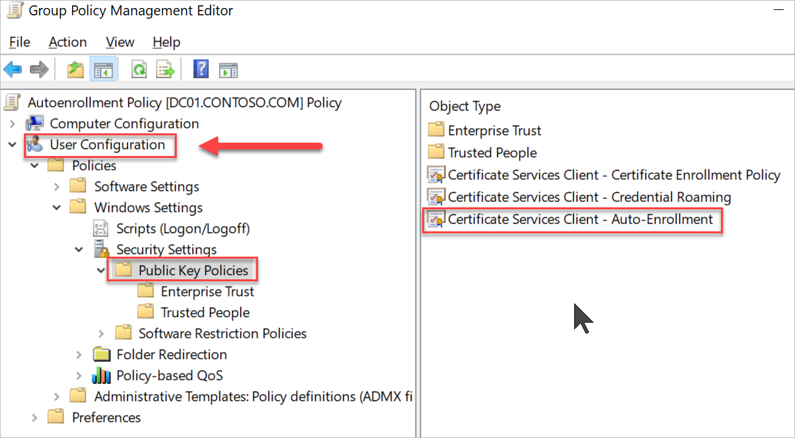

# Set up infrastructure for Always On VPN

In this tutorial, you'll learn how to deploy Always On VPN connections for remote domain-joined Windows client computers. You'll create a sample infrastructure that shows you how to implement an Always On VPN connection process. The process is composed of the following steps:

1. The Windows VPN client uses a public DNS server to perform a name resolution query for the IP address of the VPN gateway.

2. The VPN client uses the IP address returned by DNS to send a connection request to the VPN gateway.

3. The VPN server is also configured as a Remote Authentication Dial-In User Service (RADIUS) Client; the VPN RADIUS Client sends the connection request to the NPS server for connection request processing.

4. The NPS server processes the connection request, including performing authorization and authentication, and determines whether to allow or deny the connection request.

5. The NPS server forwards an Access-Accept or Access-Deny response to the VPN server.

6. The connection is initiated or terminated based on the response that the VPN server received from the NPS server.

**Prerequisites**

To complete the steps in this tutorial,

- You'll need access to four physical computers or virtual machines (VMs).

- Ensure that your user account on all machines is a member of **Administrators**, or equivalent.

**Important**

*Using Remote Access in Microsoft Azure is not supported, including both Remote Access VPN and DirectAccess. For more information, see* [<u>Microsoft server software support for Microsoft Azure virtual machines</u>](https://support.microsoft.com/help/2721672/microsoft-server-software-support-for-microsoft-azure-virtual-machines)*.*

**Step 1: Create the domain controller**

This step is already performed by CloudLabs Automation to save time.

**Step 2: Create an Active Directory Group Policy**

In this section, you'll create a Group Policy on the domain controller so that domain members automatically request user and computer certificates. This configuration lets VPN users request and retrieve user certificates that automatically authenticate VPN connections. This policy also allows the NPS server to request server authentication certificates automatically.

**Important: These steps are to be performed on DC01**

1. On the domain controller, open Group Policy Management.

    1. Open the **RUN** prompt and type **GPMC.MSC**

    

2. In the left pane, right-click your domain (for example, corp.contoso.com). Select **Create a GPO in this domain, and Link it here**.

3. On the New GPO dialog box, for **Name**, enter *Autoenrollment Policy*. Select **OK**.

4. In the left pane, right-click **Autoenrollment Policy**. Select **Edit** to open the **Group Policy Management Editor**.

5. In the **Group Policy Management Editor**, complete the following steps to configure computer certificate autoenrollment:

    1. In the left pane, go to **Computer Configuration** \> **Policies** \> **Windows Settings** \> **Security Settings** \> **Public Key Policies**.

    2. In the details pane, right-click **Certificate Services Client – Auto-Enrollment**. Select **Properties**.

    

    3. On the **Certificate Services Client – Auto-Enrollment Properties** dialog box, for **Configuration Model**, select *Enabled*.

    4. Select **Renew expired certificates, update pending certificates, and remove revoked certificates** and **Update certificates that use certificate templates**.

    

    5. Select **OK**.

6. In the **Group Policy Management Editor**, complete the following steps to Configure user certificate autoenrollment:

    1. In the left pane, go to **User Configuration** \> **Policies** \> **Windows Settings** \> **Security Settings** \> **Public Key Policies**.

    2. In the details pane, right-click **Certificate Services Client – Auto-Enrollment** and select **Properties**.

    

    3. On the **Certificate Services Client – Auto-Enrollment Properties** dialog box, in **Configuration Model**, select *Enabled*.

    4. Select **Renew expired certificates, update pending certificates, and remove revoked certificates** and **Update certificates that use certificate templates**.

    

    5. Select **OK**.

    6. Close the Group Policy Management Editor.

Once everything is done, the Group Policy Management should look like below:

7. Close Group Policy Management.
