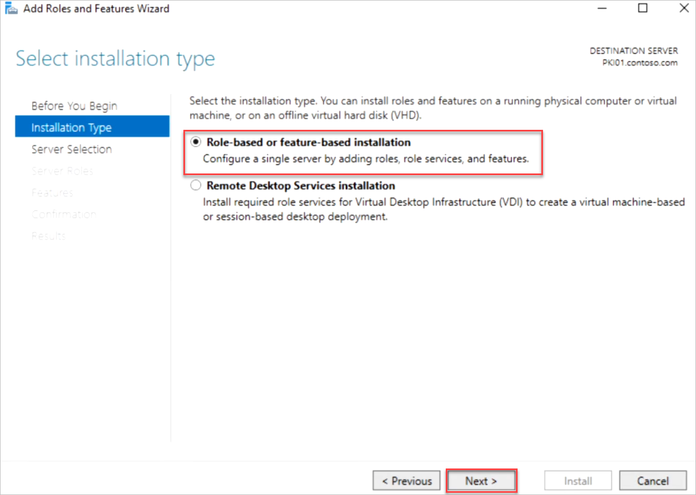
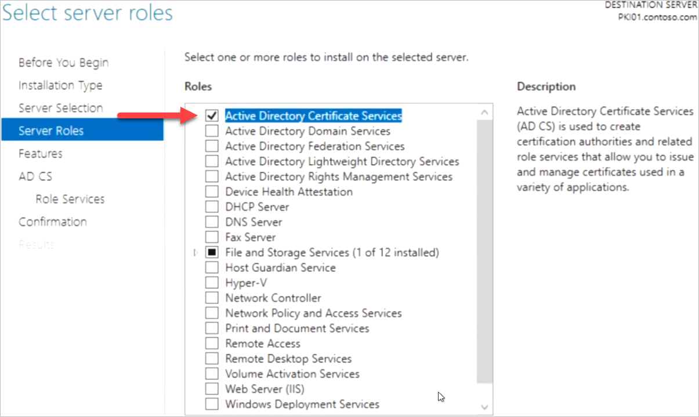
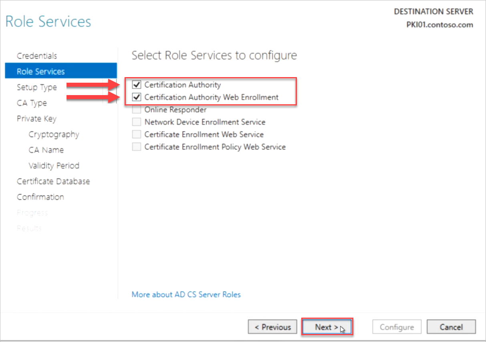
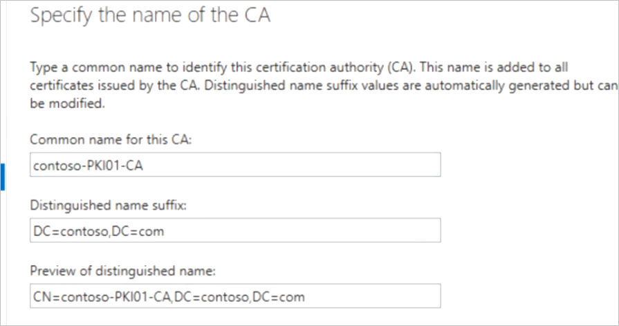

**Step 3: Configure Certificate Authority**

**Important: These steps are to be performed on PKI01**

1. Log on as a member of both the Enterprise Admins group and the root domain's Domain Admins group.

    - Use RDC Man to connect to PKI01 Server
    - Use the below credentials:

        - Admin Username: <inject key="Admin Username"></inject>
        - Admin Password: <inject key="Admin Password"></inject>

2. In Server Manager, click **Manage**, and then click **Add Roles and Features**. The Add Roles and Features Wizard opens.

3. In **Before You Begin**, click **Next**.

4. In **Select Installation Type**, ensure that **Role-Based or feature-based installation** is selected, and then click **Next**.

5. In **Select destination server**, ensure that **Select a server from the server pool** is selected. In **Server Pool**, ensure that the local computer is selected. Click **Next**.

6. In **Select Server Roles**, in **Roles**, select **Active Directory Certificate Services**. When you are prompted to add required features, click **Add Features**, and then click **Next**.

7. In **Select features**, click **Next**.

8. In **Active Directory Certificate Services**, read the provided information, and then click **Next**.

9. In **Role Services**, click **Certification Authority**, click **Certification Authority Web Enrollment**, and then click **Next**.

10. In **Confirm installation selections**, click **Install**. Do not close the wizard during the installation process. When installation is complete, click **Configure Active Directory Certificate Services on the destination server**. The AD CS Configuration wizard opens. Read the credentials information and, if needed, provide the credentials for an account that is a member of the Enterprise Admins group. Click **Next**.

- In **Role Services**, click **Certification Authority**, click **Certification Authority Web Enrollment**, and then click **Next**.

11. On the **Setup Type** page, verify that **Enterprise CA** is selected, and then click **Next**.

12. On the **Specify the type of the CA** page, verify that **Root CA** is selected, and then click **Next**.

13. On the **Specify the type of the private key** page, verify that **Create a new private key** is selected, and then click **Next**.

14. On the **Cryptography for CA** page, keep the default settings for CSP (**RSA#Microsoft Software Key Storage Provider**) and hash algorithm (**SHA256**), and determine the best key character length for your deployment. Large key character lengths provide optimal security; however, they can impact server performance and might not be compatible with legacy applications. It is recommended that you keep the default setting of 2048. Click **Next**.

15. On the **CA Name** page, keep the suggested common name for the CA or change the name according to your requirements. Ensure that you are certain the CA name is compatible with your naming conventions and purposes, because you cannot change the CA name after you have installed AD CS. Click **Next**.

16. On the **Validity Period** page, in **Specify the validity period**, type the number and select a time value (Years, Months, Weeks, or Days). The default setting of five years is recommended. Click **Next**.

17. On the **CA Database** page, in **Specify the database locations**, specify the folder location for the certificate database and the certificate database log. If you specify locations other than the default locations, ensure that the folders are secured with access control lists (ACLs) that prevent unauthorized users or computers from accessing the CA database and log files. Click **Next**.

18. In **Confirmation**, click **Configure** to apply your selections, and then click **Close**.

