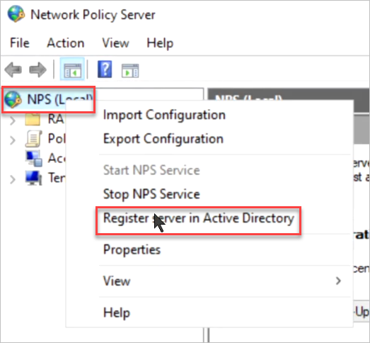

**Step 4: Configure NPS Server**

**Important: These steps are to be performed on NPS01**

1. On NPS01, in Server Manager, click **Manage**, and then click **Add Roles and Features**. The Add Roles and Features Wizard opens.

2. In **Before You Begin**, click **Next**.

3. In **Select Installation Type**, ensure that **Role-Based or feature-based installation** is selected, and then click **Next**.

4. In **Select destination server**, ensure that **Select a server from the server pool** is selected. In **Server Pool**, ensure that the local computer is selected. Click **Next**.

5. In **Select Server Roles**, in **Roles**, select **Network Policy and Access Services**. A dialog box opens asking if it should add features that are required for Network Policy and Access Services. Click **Add Features**, and then click **Next**

6. In **Select features**, click **Next**, and in **Network Policy and Access Services**, review the information that is provided, and then click **Next**.

7. In **Select role services**, click **Network Policy Server**. In **Add features that are required for Network Policy Server**, click **Add Features**. Click **Next**.

8. In **Confirm installation selections**, click **Restart the destination server automatically if required**. When you are prompted to confirm this selection, click **Yes**, and then click **Install**. The Installation progress page displays status during the installation process. When the process completes, the message "Installation succeeded on *ComputerName*" is displayed, where *ComputerName* is the name of the computer upon which you installed Network Policy Server. Click **Close**.

9. On the NPS, in Server Manager, click **Tools**, and then click **Network Policy Server**. The Network Policy Server console opens.

10. Right-click **NPS (Local)**, and then click **Register Server in Active Directory**. The **Network Policy Server** dialog box opens.

11. In **Network Policy Server**, click **OK**, and then click **OK** again.
