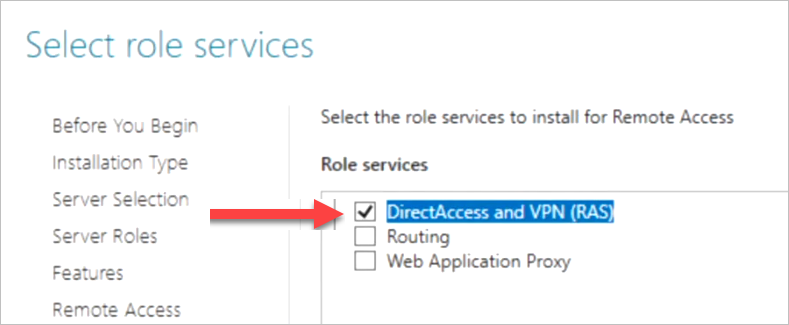
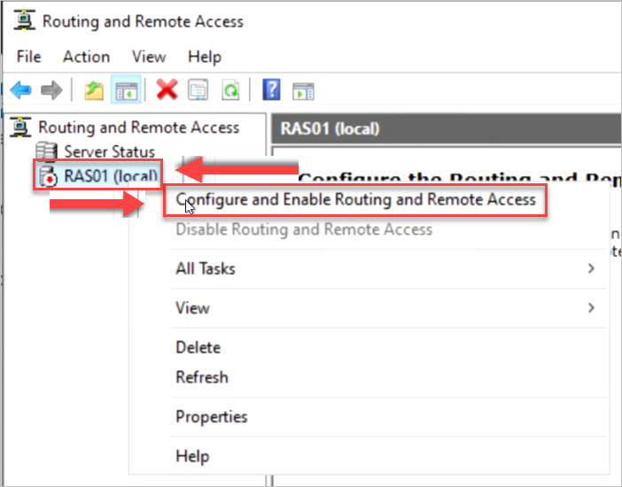
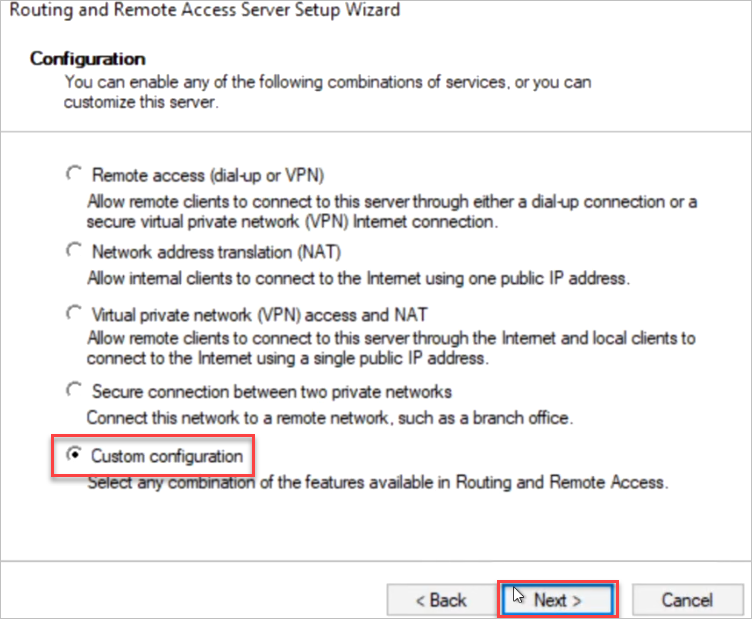
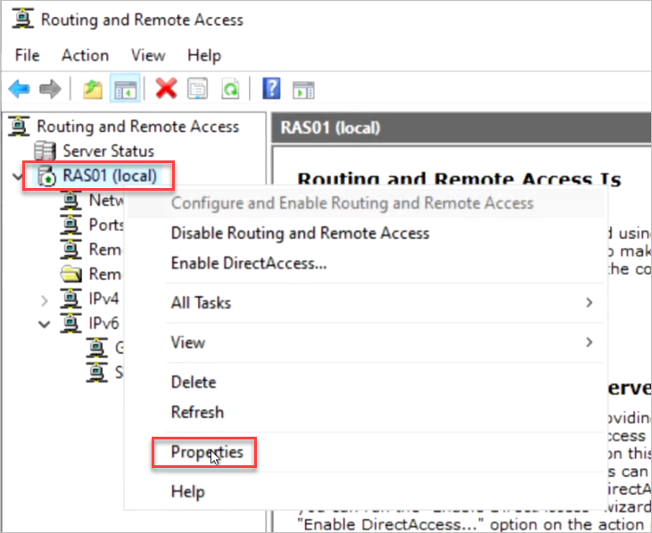
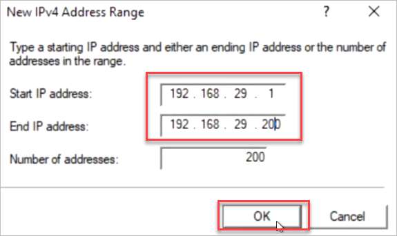
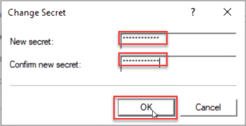

**Step 5: Configure VPN Server**

**Important: These steps are to be performed on RAS01**

1. On the Windows server, in Server Manager, select **Manage** and select **Add Roles and Features** to open the Add Roles and Features Wizard.

2. On the Before you begin page, select **Next**.

3. On the Select Installation Type page, select **Role-Based or feature-based installation** and select **Next**.

4. On the Select destination server page, select **Select a server from the server pool** .

5. Under Server Pool, select the local computer and select **Next**.

6. On the Select server roles page, in **Roles**, select **Remote Access**, then **Next**.

7. On the Select features page, select **Next**.

8. On the Remote Access page, select **Next**.

9. On the Select role service page, in **Role services**, select **DirectAccess and VPN (RAS)**.

10. On the Confirm installation selections page, review your choices, then select **Install**.

11. When the installation is complete, select **Open the Getting Started Wizard**.

**OR**

- On the VPN server, in Server Manager, select the Notifications flag. You may have to wait a minute or two to see the Notifications flag.

- In the **Tasks** menu, select **Open the Getting Started Wizard** to open the Configure Remote Access wizard

14. Select *Deploy VPN only* to open the Routing and Remote Access Microsoft Management Console (MMC).

15. Right-click the VPN server, and then select *Configure and Enable Routing and Remote Access* to open the Routing and Remote Access Server Setup Wizard.

16. In the Welcome to the Routing and Remote Access Server Setup Wizard, select **Next**.

17. In **Configuration**, select *Custom Configuration*, and then select **Next**.

18. In **Custom Configuration**, select *VPN access*, and then select **Next** to open the Completing the Routing and Remote Access Server Setup Wizard.

19. Select **Finish** to close the wizard, then select **Start service** to close the Routing and Remote Access dialog box.

20. Once the VPN server is running, right-click the VPN server and select **Properties**.

21. Select the **IPv4** tab and do the following steps:

    1. Select **Static address pool**.

    2. Select **Add** to configure an IP address pool.

    

    3. In **Start IP address**, enter the starting IP address **192.168.29.1**

    4. In **End IP address**, enter the ending IP address **192.168.29.200**

    

22. Select **OK** to close the Properties dialog.

23. In Properties, select the **Security** tab and then:

    1. Select **Authentication provider** and select **RADIUS Authentication**.

    

    2. Select **Configure** to open the RADIUS Authentication dialog.

    

    3. Select **Add** to open the Add RADIUS Server dialog.

    

       a. In **Server name**, enter the Fully Qualified Domain Name (FQDN) of the NPS server:
       
        NPS01.Contoso.Com

    b. In **Shared secret**, select **Change** to open the Change Secret dialog box.

    

    c. In **New secret**, enter a text string:

        Password.1!!

    d. In **Confirm new secret**, enter the same text string, then select **OK**.

    

    e. Save this secret. You'll need it when you add this VPN server as a RADIUS client later in this tutorial.

    f. Select **OK** to close the Add RADIUS Server dialog.

    g. Select **OK** to close the Radius Authentication dialog.

24. On the VPN server Properties dialog, select **Authentication Methods...**.

25. Select **Allow machine certificate authentication for IKEv2**.

26. Select **OK**.

27. For **Accounting provider**, select *Windows Accounting*.

28. Select **OK** to close the Properties dialog.

29. A dialog will prompt you to restart the server. Select **Yes**.