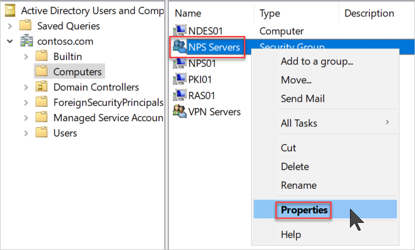
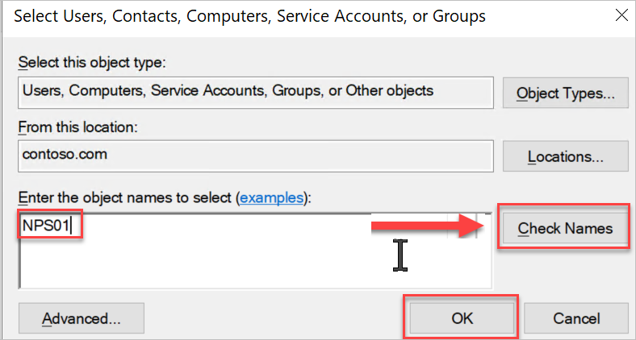

**Step 6: Create AD Groups for Servers and VPN Users**

**Important: These steps are to be performed on DC01**

**Create the NPS Servers group:**

1. On the domain controller, open Active Directory Users and Computers.

2. Under your domain, right-click **Computers**. Select **New**, then select **Group**.

3. In **Group name**, enter **NPS Servers**, then select **OK**.

4. Right-click **NPS Servers** and select **Properties**.

5. On the **Members** tab of the NPS Servers Properties dialog box, select **Add**.

6. select **Object Types**, select the **Computers** check box, then select **OK**.

7. In **Enter the object names to select**, enter the computer name of the NPS server, Click **Check Names**.

8. Select **OK**.

**Create the VPN Servers group:**

1. On the domain controller, open Active Directory Users and Computers.

2. Under your domain, right-click **Computers**. Select **New**, then select **Group**.

3. In **Group name**, enter **VPN Servers**, then select **OK**.

4. Right-click **VPN Servers** and select **Properties**.

5. On the **Members** tab of the VPN Servers Properties dialog box, select **Add**.

6. select **Object Types**, select the **Computers** check box, then select **OK**.

7. In **Enter the object names to select**, enter the computer name of the VPN server.

8. Select **OK**.

**Create the VPN Users group:**

1. Create a VPN User by taking the following steps:

    1. On the domain controller, open Active Directory Users and Computers.

    2. Under your domain, right-click **Users**. Select **New**. For **User logon name**, enter any logon name. Select **Next**.

    3. Choose a password for the user.

    4. Deselect **User must change password at next logon**. Select **Password never expires**.

    5. Select **Finish**. Keep Active Directory Users and Computers open.

2. Create a VPN User group by taking the following steps:

    1. Under your domain, right-click **Users**. Select **New**, then select **Group**.

    

    

    2. In **Group name**, enter **VPN Users**, then select **OK**.

    3. Right-click **VPN Users** and select **Properties**.

    4. On the **Members** tab of the VPN Users Properties dialog box, select **Add**.

    5. On the Select Users dialog box, add the VPN user that you created and select **OK**.