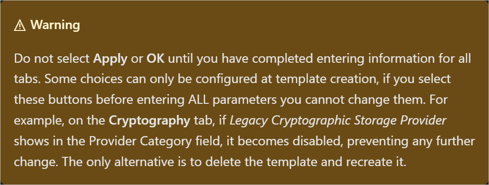

**Step 7: Configure VPN server as a RADIUS client**

**Important: These steps are to be performed on NPS01**

1. In the NPS console, double-click **RADIUS Clients and Servers**.

2. Right-click **RADIUS Clients** and select **New** to open the New RADIUS Client dialog box.

3. Verify that the **Enable this RADIUS client** check box is selected.

4. In **Friendly name**, enter a display name for the VPN server: **RAS01.Contoso.Com**

5. In **Address (IP or DNS)**, enter the IP address or FQDN of the VPN server: **RAS01.Contoso.Com**

    1. If you enter the FQDN, select **Verify** if you want to verify that the name is correct and maps to a valid IP address.

6. In **Shared secret**:

    1. Ensure that **Manual** is selected.

    2. Enter the secret: **Password.1!!**

    3. For **Confirm shared secret**, re-enter the shared secret.

7. Select **OK**. The VPN Server should appear in the list of RADIUS clients configured on the NPS server.

**Step 8: Configure NPS server as a RADIUS server**

**Important: These steps are to be performed on NPS01**

1. In the NPS console, select **NPS(Local)**.

2. In Standard Configuration, ensure that **RADIUS server for Dial-Up or VPN Connections** is selected.

3. Select **Configure VPN or Dial-Up** to open the Configure VPN or Dial-Up wizard.

4. Select *Virtual Private Network (VPN) Connections*, and select **Next**.

5. In Specify Dial-Up or VPN Server, in RADIUS clients, select the name of the VPN server.

6. Select **Next**.

7. In Configure Authentication Methods, complete the following steps:

    1. Clear **Microsoft Encrypted Authentication version 2 (MS-CHAPv2)** .

    2. Select **Extensible Authentication Protocol**.

    3. For **Type**, select **Microsoft: Protected EAP (PEAP)**. Then select **Configure** to open the Edit Protected EAP Properties dialog box.

    4. Select **Remove** to remove the Secured Password (EAP-MSCHAP v2) EAP type.

    5. Select **Add**. The Add EAP dialog box opens.

    6. Select **Smart Card or other certificate**, then select **OK**.

    7. Select **OK** to close Edit Protected EAP Properties.

8. Select **Next**.

9. In Specify User Groups, complete the following steps:

    1. Select **Add**. The Select Users, Computers, Service Accounts, or Groups dialog box opens.

    2. Enter **VPN Users**, then select **OK**.

    3. Select **Next**.

10. On **Specify IP Filters**, select **Next**.

11. On **Specify Encryption Settings**, select **Next**. Do not make any changes.

12. On **Specify a Realm Name**, select **Next**.

13. Select **Finish** to close the wizard.

**Step 8: Deploy Always On VPN - Configure Certificate Authority templates**

**Important: These steps are to be performed on PKI01**

In this part of the Deploy Always On VPN tutorial, you'll create certificate templates and enroll or validate certificates for the Active Directory (AD) groups

You'll create the following templates:

- *User authentication template*. With a user authentication template, you can improve certificate security by selecting upgraded compatibility levels and choosing the Microsoft Platform Crypto Provider. With the Microsoft Platform Crypto Provider, you can use a Trusted Platform Module (TPM) on client computers to secure the certificate. The user template will be configured for auto-enrollment.

- *VPN server authentication template*. With a VPN server authentication template, you'll add the IP Security (IPsec) IKE Intermediate application policy. The IP Security (IPsec) IKE Intermediate application policy determines how the certificate can be used, it can allow the server to filter certificates if more than one certificate is available. Because VPN clients access this server from the public internet, the subject and alternative names are different than the internal server name. As a result, you won't configure the VPN server certificate for auto-enrollment.

- *NPS server authentication template*. With an NPS server authentication template, you'll copy the standard RAS and IAS Servers template, and scope it for your NPS server. The new NPS server template includes the server authentication application policy.

**Create the user authentication template**

1. On the PKI01 server, open the Certification Authority snap-in.

2. In the left pane, right-click **Certificate Templates** and select **Manage**.

3. In the Certificate Templates console, right-click **User** and select **Duplicate Template**.

4. In the Properties of New Template dialog box, on the **General** tab, complete the following steps:

    1. In **Template display name**, enter *VPN User Authentication*.

    2. Clear the **Publish certificate in Active Directory** check box.

5. On the **Security** tab, complete the following steps:

    1. Select **Add**.

    2. On the Select Users, Computers, Service Accounts, or Groups dialog, enter **VPN Users**, then select **OK**.

    3. In **Group or user names**, select **VPN Users**.

    4. In **Permissions for VPN Users**, select the **Enroll** and **Autoenroll** check boxes in the **Allow** column.

6. In **Group or user names**, select **Domain Users**, then select **Remove**.

1. On the **Compatibility** tab, complete the following steps:

    1. In **Certification Authority**, select *Windows Server 2016*.

    2. On the **Resulting changes** dialog, select **OK**.

    3. In **Certificate recipient**, select *Windows 10/Windows Server 2016*.

    4. On the **Resulting changes** dialog, select **OK**.

2. On the **Request Handling** tab, clear **Allow private key to be exported** .

3. On the **Cryptography** tab, complete the following steps:

    1. In **Provider Category**, select **Key Storage Provider**.

    2. Select **Requests must use one of the following providers**.

    3. Select both **Microsoft Platform Crypto Provider** and **Microsoft Software Key Storage Provider**.

4. On the **Subject Name** tab, clear the **Include e-mail name in subject name** and **E-mail name** .

5. Select **OK** to save the VPN User Authentication certificate template.

6. Close the Certificate Templates console.

7. In the left pane of the Certification Authority snap-in, right-click **Certificate Templates**, select **New** and then select **Certificate Template to Issue**.

8. Select **VPN User Authentication**, then select **OK**.

**Create the VPN Server authentication template**

1. In the left pane of the Certification Authority snap-in, right-click **Certificate Templates** and select **Manage** to open the Certificate Templates console.

2. In the Certificate Templates console, right-click **RAS and IAS Server** and select **Duplicate Template**.

1. On the Properties of New Template dialog box, on the **General** tab, in **Template display name**, enter *VPN Server Authentication*.

2. On the **Extensions** tab, complete the following steps:

    1. Select **Application Policies**, then select **Edit**.

    2. In the **Edit Application Policies Extension** dialog, select **Add**.

    3. On the **Add Application Policy** dialog, select **IP security IKE intermediate**, then select **OK**.

    4. Select **OK** to return to the **Properties of New Template** dialog.

3. On the **Security** tab, complete the following steps:

    1. Select **Add**.

    2. On the **Select Users, Computers, Service Accounts, or Groups** dialog, enter **VPN Servers**, then select **OK**.

    3. In **Group or user names**, select **VPN Servers**.

    4. In **Permissions for VPN Servers**, select **Enroll** in the **Allow** column.

    5. In **Group or user names**, select **RAS and IAS Servers**, then select **Remove**.

4. On the **Subject Name** tab, complete the following steps:

    1. Select **Supply in the Request**.

    2. On the **Certificate Templates** warning dialog box, select **OK**.

5. Select **OK** to save the VPN Server certificate template.

6. Close the Certificate Templates console.

7. In the left pane of the Certificate Authority snap-in, right-click **Certificate Templates**. Select **New** and then select **Certificate Template to Issue**.

8. Select **VPN Server Authentication**, then select **OK**.

9. Reboot the VPN server.

**Create the NPS Server authentication template**

1. In the left pane of the Certification Authority snap-in, right-click **Certificate Templates** and select **Manage** to open the Certificate Templates console.

2. In the Certificate Templates console, right-click **RAS and IAS Server** and select **Duplicate Template**.

1. On the Properties of New Template dialog box, on the **General** tab, in **Template display name**, enter *NPS Server Authentication*.

2. On the **Security** tab, complete the following steps:

    1. Select **Add**.

    2. On the **Select Users, Computers, Service Accounts, or Groups** dialog, enter **NPS Servers**, then select **OK**.

    3. In **Group or user names**, select **NPS Servers**.

    4. In **Permissions for NPS Servers**, select **Enroll** in the **Allow** column.

    5. In **Group or user names**, select **RAS and IAS Servers**, then select **Remove**.

3. Select **OK** to save the NPS Server certificate template.

4. Close the Certificate Templates console.

5. In the left pane of the Certificate Authority snap-in, right-click **Certificate Templates**. Select **New** and then select **Certificate Template to Issue**.

6. Select **NPS Server Authentication**, then select **OK**.

**Enroll and validate the VPN server certificate**

**To enroll the VPN server's certificate:**

1. On the VPN server's Start menu, type **certlm.msc** to open the Certificates snap-in, and press ENTER.

2. Right-click **Personal**, select **All Tasks** and then select **Request New Certificate** to start the Certificate Enrollment Wizard.

3. On the Before You Begin page, select **Next**.

4. On the Select Certificate Enrollment Policy page, select **Next**.

5. On the Request Certificates page, select **VPN Server Authentication**.

6. Under the VPN server check box, select **More information is required** to open the Certificate Properties dialog box.

7. Select the **Subject** tab and enter the following information:*In the **Subject name** section:*

    a. For **Type** select *Common Name*.

    b. For **Value**, enter the name of the external domain that clients use to connect to the VPN:
    
            RAS01.contoso.com

    c. Select **Add**.

    d. Enter the following information:*In the **Alternative name** section:*

    e. For **Type** select *DNS*

    f. For **Value**, enter the Public DNS Name of the Public IP assigned to the RAS Server:

    - RAS DNS Name: <inject key="Ras DNS Name"></inject>

    g. Select **Add**.    

    

8. Select **OK** to close Certificate Properties.

9. Select **Enroll**.

10. Select **Finish**.

**To validate the VPN server certificate:**

1. In the Certificates snap-in, under **Personal**, select **Certificates**.Your listed certificates should appear in the details pane.

2. Right-click the certificate that has your VPN server's name, and then select **Open**.

3. On the **General** tab, confirm that the date listed under **Valid from** is today's date. If it isn't, you might have selected the wrong certificate.

4. On the **Details** tab, select **Enhanced Key Usage**, and verify that **IP security IKE intermediate** and **Server Authentication** display in the list.

5. Select **OK** to close the certificate.

**Enroll and validate the NPS certificate**

**To enroll the NPS certificate:**

1. On the NPS server's Start menu, type **certlm.msc** to open the Certificates snap-in, and press ENTER.

2. Right-click **Personal**, select **All Tasks** and then select **Request New Certificate** to start the Certificate Enrollment Wizard.

3. On the Before You Begin page, select **Next**.

4. On the Select Certificate Enrollment Policy page, select **Next**.

5. On the Request Certificates page, select **NPS Server Authentication**.

6. Select **Enroll**.

7. Select **Finish**.

**To validate the NPS certificate:**

1. In the Certificates snap-in, under **Personal**, select **Certificates**. Your listed certificates should appear in the details pane.

2. Right-click the certificate that has your NPS server's name, and then select **Open**.

3. On the **General** tab, confirm that the date listed under **Valid from** is today's date. If it isn't, you might have selected the wrong certificate.

4. Select **OK**, and close the Certificates snap-in.
