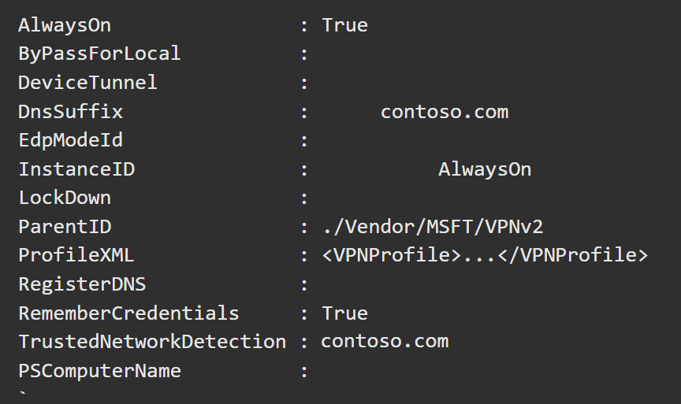

**Step 9: Deploy Always On VPN - Configure Always On VPN profile for Windows 10+ clients**

In this part of the tutorial, you'll learn how to use a ProfileXML PowerShell configuration script to configure Always On VPN settings and create a user tunnel for client connections.

**Important: These steps are to be performed on DC01**

**Connecting to the Windows 11 Client VMs**

1. Sign in to the Azure Portal from the Lab VM (DC01)

2. Search and Select **Virtual Machines** in the Azure Portal

3. Follow the instructor for steps to create a new Windows 11 Client VM

**Connect the Azure Virtual Networks using vNet Peering**

1. Follow the instructor for steps to create vNet Peering

2. Once the vNet Peering is established, Enusre that DC01's Private IP is being used as DNS Server across the Client vNet

**Create an Always On VPN client profile**

In this section, we'll create a VPN client connection in order to verify that the VPN test client can establish a successful VPN connection. This will also allow us to create the EAP settings for export in the next section.

1. Sign in to the domain-joined VPN client computer as the VPN user you created.

2. On the Start menu, type **VPN** to select **VPN Settings**. Press ENTER.

3. In the details pane, select Add a **VPN connection**.

4. For **VPN Provider**, select *Windows (built-in)*.

5. For **Connection Name**, enter:

        AlwaysOn

6. For Server name or address, enter the external FQDN of the RAS Server:

    - <inject key="Ras DNS Name"></inject>

7. For **VPN type**, select *IKEv2*.

8. For **Type of sign-in info**, select *Certificate*.

9. Select **Save**.

10. Under Related Settings, select **Change adapter options**.

11. Right-click **AlwaysOn**, and select **Properties**.

12. On the **Security** tab, for **Data encryption**, select *Maximum strength encryption*.

13. Select **Use Extensible Authentication Protocol (EAP)**. Then, for **Use Extensible Authentication Protocol (EAP)**, select *Microsoft: Protected EAP (PEAP) (encryption enabled)*.

14. Select **Properties** to open Protected EAP Properties, and complete the following steps:

    a. For **Connect to these servers**, enter the name of the NPS server:

        NPS01.contoso.com

    b. For **Trusted Root Certification Authorities**, select the Contoso CA that issued the NPS server's certificate.

    c. For **Notifications before connecting**, select *Don't ask user to authorize new servers or trusted CAs*.

    d. For **Select Authentication Method**, select **Smart Card or other certificate**.

    e. Select **Configure**.

    - Select **Use a certificate on this computer**.

    - For **Connect to these servers**, enter the name of the NPS server.

            NPS01.contoso.com

    - For **Trusted Root Certification Authorities**, select the Contoso CA that issued the NPS server's certificate.

    - Select **Don't prompt user to authorize new servers or trusted certification authorities**.

    - Select **OK** to close Smart Card or other Certificate Properties.

    - Select **OK** to close Protected EAP Properties.

    - Select **OK** to close Contoso VPN Properties.

15. Close the Network Connections window.

16. In Settings, select **AlwaysOn**, and then select **Connect**.

**Configure your Windows VPN client**

In this section, you'll manually configure the Windows VPN client using a PowerShell script.

1. Sign in as Admin User to the VPN client computer.

2. Open Windows PowerShell integrated scripting environment (ISE) as Administrator.

3. Copy the RAS Server DNS Name to be used in the below PowerShell Script:

    - <inject key="Ras DNS Name"></inject>

4. Copy and paste the following script:

### **Important: DO NOT miss replacing the $Servers with the above value before running the script**

        # Define key VPN profile parameters
        # Replace with your own values

        $Servers = 'xxxxxxxxxxx' #Public or routable IP address or DNS name for the VPN gateway.

        $Domain = 'contoso.com' # Name of the domain.

        $TemplateName = 'AlwaysOn' # Name of the test VPN connection you created in the tutorial.

        $ProfileName = 'AlwaysOn-Profile' # Name of the profile we are going to create.

        $DnsSuffix = 'contoso.com' # Specifies one or more commas separated DNS suffixes.

        $DomainName = '.contoso.com' #Used to indicate the namespace to which the policy applies. Contains `.` prefix.

        $DNSServers = '10.0.0.4' #List of comma-separated DNS Server IP addresses to use for the namespace.

        $TrustedNetwork = 'contoso.com' #Comma-separated string to identify the trusted network.

        #Get the EAP settings for the current profile called $TemplateName

        $Connection = Get-VpnConnection -Name $TemplateName

        if(!$Connection)
        {
            $Message = "Unable to get $TemplateName connection profile: $_"
            Write-Host "$Message"
            exit
        }

        $EAPSettings= $Connection.EapConfigXmlStream.InnerXml

        $ProfileNameEscaped = $ProfileName -replace ' ', '%20'

        # Define ProfileXML
        $ProfileXML = @("
        <VPNProfile>
        <DnsSuffix>$DnsSuffix</DnsSuffix>
        <NativeProfile>
        <Servers>$Servers</Servers>
        <NativeProtocolType>IKEv2</NativeProtocolType>
        <Authentication>
        <UserMethod>Eap</UserMethod>
        <Eap>
            <Configuration>
            $EAPSettings
            </Configuration>
        </Eap>
        </Authentication>
        <RoutingPolicyType>SplitTunnel</RoutingPolicyType>
        </NativeProfile>
        <AlwaysOn>true</AlwaysOn>
        <RememberCredentials>true</RememberCredentials>
        <TrustedNetworkDetection>$TrustedNetwork</TrustedNetworkDetection>
        <DomainNameInformation>
        <DomainName>$DomainName</DomainName>
        <DnsServers>$DNSServers</DnsServers>
        </DomainNameInformation>
        </VPNProfile>
        ")

        #Output the XML for possible use in Intune
        $ProfileXML | Out-File -FilePath ($env:USERPROFILE + '\desktop\VPN_Profile.xml')

        # Escape special characters in the profile (<,>,")
        $ProfileXML = $ProfileXML -replace '<', '&lt;'
        $ProfileXML = $ProfileXML -replace '>', '&gt;'
        $ProfileXML = $ProfileXML -replace '"', '&quot;'

        # Define WMI-to-CSP Bridge properties
        $nodeCSPURI = "./Vendor/MSFT/VPNv2"
        $namespaceName = "root\cimv2\mdm\dmmap"
        $className = "MDM_VPNv2_01"

        try
        {

        # Determine user SID for VPN profile.
            $WmiLoggedOnUsers = (Get-WmiObject Win32_LoggedOnUser).Antecedent
            If($WmiLoggedOnUsers.Count -gt 1) { 
                $WmiLoggedOnUsers = $WmiLoggedOnUsers -match "Domain=""$Domain"""
            }

        $WmiUserValid = ($WmiLoggedOnUsers | Select-Object -Unique -First 1) -match 'Domain="([^"]+)",Name="([^"]+)"'

        If(-not $WmiUserValid){
                Throw "Returned object is not a valid WMI string"
            }

        $UserName = "$($Matches[1])\$($Matches[2])"

        $ObjUser = New-Object System.Security.Principal.NTAccount($UserName)
            $Sid = $ObjUser.Translate([System.Security.Principal.SecurityIdentifier])
            $SidValue = $Sid.Value
            $Message = "User SID is $SidValue."

        Write-Host "$Message"

        }
        catch [Exception] 
        {

        $Message = "Unable to get user SID. $_"
            Write-Host "$Message" 
            exit
        }

        try 
        {
            # Define WMI session.
            $session = New-CimSession
            $options = New-Object Microsoft.Management.Infrastructure.Options.CimOperationOptions
            $options.SetCustomOption("PolicyPlatformContext_PrincipalContext_Type", "PolicyPlatform_UserContext", $false)
            $options.SetCustomOption("PolicyPlatformContext_PrincipalContext_Id", "$SidValue", $false)

        }
        catch {

        $Message = "Unable to create new session for $ProfileName profile: $_"
            Write-Host $Message
            exit
        }

        try
        {
            #Detect and delete previous VPN profile.
            $deleteInstances = $session.EnumerateInstances($namespaceName, $className, $options)

        foreach ($deleteInstance in $deleteInstances)
            {
                $InstanceId = $deleteInstance.InstanceID
                if ("$InstanceId" -eq "$ProfileNameEscaped")
                {
                    $session.DeleteInstance($namespaceName, $deleteInstance, $options)
                    $Message = "Removed $ProfileName profile $InstanceId" 
                    Write-Host "$Message"
                }
                else 
                {
                    $Message = "Ignoring existing VPN profile $InstanceId"
                    Write-Host "$Message"
                }
            }
        }
        catch [Exception]
        {
            $Message = "Unable to remove existing outdated instance(s) of $ProfileName profile: $_"
            Write-Host $Message
            exit

        }

        try
        {
            # Create the VPN profile.
            $newInstance = New-Object Microsoft.Management.Infrastructure.CimInstance $className, $namespaceName
            $property = [Microsoft.Management.Infrastructure.CimProperty]::Create("ParentID", "$nodeCSPURI", "String", "Key")
            $newInstance.CimInstanceProperties.Add($property)
            $property = [Microsoft.Management.Infrastructure.CimProperty]::Create("InstanceID", "$ProfileNameEscaped", "String", "Key")
            $newInstance.CimInstanceProperties.Add($property)
            $property = [Microsoft.Management.Infrastructure.CimProperty]::Create("ProfileXML", "$ProfileXML", "String", "Property")
            $newInstance.CimInstanceProperties.Add($property)
            $session.CreateInstance($namespaceName, $newInstance, $options)

        $Message = "Created $ProfileName profile."
            Write-Host "$Message"

        }
        catch [Exception]
        {

        $Message = "Unable to create $ProfileName profile: $_"
            Write-Host "$Message"
            exit
        }

        $Message = "Script Complete"
        Write-Host "$Message"

5. Press ENTER to run the script.

6. Verify that the script was successful by running the following command in the Windows PowerShell ISE:

        Get-CimInstance -Namespace root\cimv2\mdm\dmmap -ClassName MDM_VPNv2_01

7. You should see the following output:

    

You have now configured your user tunnel for Always On VPN
