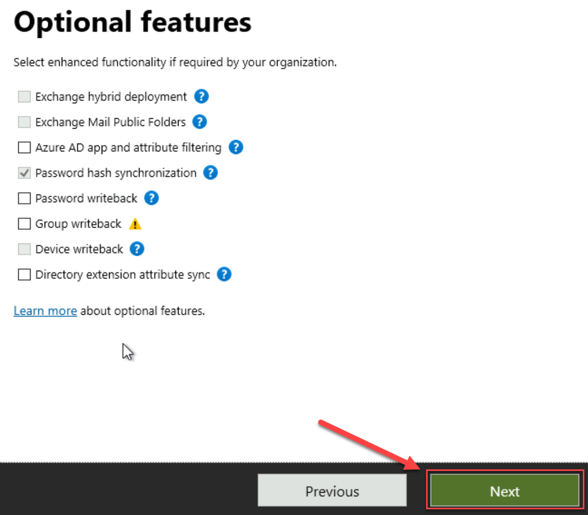

**Step 10: Deploy Always On VPN - Configure Microsoft Entra hybrid join**

Bringing your devices to Microsoft Entra ID maximizes user productivity through single sign-on (SSO) across your cloud and on-premises resources.

**Install Microsoft Entra Connect**

1. Login to Azure from DC01 (Lab VM)

2. Search for "Microsoft Entra" and select it:

    

3. Select **Microsoft Entra Connect**

    

4. Click **Connect Sync** and then Click **Download Microsoft Entra Connect**

    

5. Save the **Microsoft Entra Connect** and Run it to start the Installation:

6. Select terms agreement and click **Continue**

    

7. Select **Customize**

    

8. Select **Install**

    

9. Select **Password Hash Synchronization** and **Enable single sign-on** and Click **Next**

    

10. Enter Azure Credentials and Click **Next**

    - <inject key="AzureAdUserEmail"></inject>
    - <inject key="AzureAdUserPassword"></inject>

    

11. Click **Add Directory**

    

12. Enter the **ENTERPRISE ADMIN USERNAME** as below:

    - CONTOSO\ <inject key="Admin Username"></inject>

    - <inject key="Admin Password"></inject>

    

13. Verify the screen looks like below:

    

14. Select **Continue without matching all UPN suffixes to verified domains** and click **Next**

    

15. Click **Next** on this screen:

    

16. Click **Next** on this screen:

    

17. Click **Next** on this screen:

    

18. Click **Next** on this screen:

    

19. If you see Red Cross like below, Enter the **ENTERPRISE ADMIN USERNAME** as below:

    

    - CONTOSO\ <inject key="Admin Username"></inject>

    - <inject key="Admin Password"></inject>

    

20. Click **Next** once you see Green Check next to **Enter credentials**:

    

21. Click install on the next screen:

    

22. Click **Exit** on the last screen:

    

**Configuring Device Options**

1. Run **Azure AD Connect** again:

    

2. Click **Configure**

    

2. Under **Tasks**, select **Configure device options** and Click **Next**

    

3. Click **Next**

    

4. Enter Azure Credentials and Click **Next**

    - <inject key="AzureAdUserEmail"></inject>
    - <inject key="AzureAdUserPassword"></inject>

    

5. Click **Next**

    

6. Select **Windows 10 or later domain-joined devices.** and click **Next**

    

7. On the SCP page, perform the following steps to configure the service connection point for Contoso forest:

    - Select the **Forest** as *contoso.com*, Select the **Authentication Service** as *Azure Active Directory*, Click **Add** and specify the enterprise administrator credentials:

        - CONTOSO\ <inject key="Admin Username"></inject>
        - <inject key="Admin Password"></inject>

        

8. Click **Next** and then click **Configure**

    

9. Click **Exit**

    
