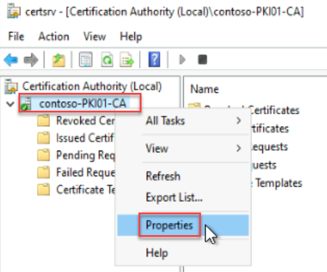
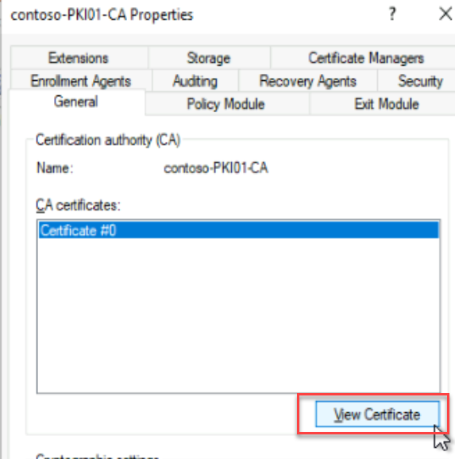
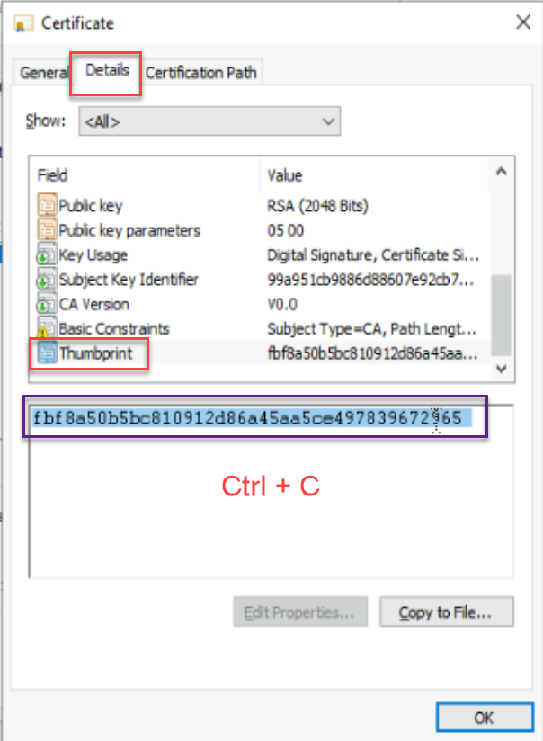

# Lab 2: Deploy Always On VPN profile to Windows 10 or newer clients with Microsoft Intune

**Create the Extensible Authentication Protocol (EAP) configuration XML**

In this section, you'll create an Extensible Authentication Protocol (EAP) configuration XML.

1. First, let's copy the certificate thumbprint of our on-premises root certificate authority.

    - Login to **PKI01** Server and Launch the CA Console, Right Click the CA and Go to **Propeties**

    

2. Click **View Certificate**

    

3. Copy the **Thumbprint** by Pressing **CTRL + C** on the Keyboard

    

- **Save the Thumbprint in a Notepad for later use.**

4. Copy the following XML string to a text editor (Notepad):

        <EapHostConfig xmlns="http://www.microsoft.com/provisioning/EapHostConfig"><EapMethod><Type xmlns="http://www.microsoft.com/provisioning/EapCommon">25</Type><VendorId xmlns="http://www.microsoft.com/provisioning/EapCommon">0</VendorId><VendorType xmlns="http://www.microsoft.com/provisioning/EapCommon">0</VendorType><AuthorId xmlns="http://www.microsoft.com/provisioning/EapCommon">0</AuthorId></EapMethod><Config xmlns="http://www.microsoft.com/provisioning/EapHostConfig"><Eap xmlns="http://www.microsoft.com/provisioning/BaseEapConnectionPropertiesV1"><Type>25</Type><EapType xmlns="http://www.microsoft.com/provisioning/MsPeapConnectionPropertiesV1"><ServerValidation><DisableUserPromptForServerValidation>true</DisableUserPromptForServerValidation><ServerNames>NPS01.contoso.com</ServerNames><TrustedRootCA>XXXXXXXXXXXXXXXX</TrustedRootCA></ServerValidation><FastReconnect>true</FastReconnect><InnerEapOptional>false</InnerEapOptional><Eap xmlns="http://www.microsoft.com/provisioning/BaseEapConnectionPropertiesV1"><Type>13</Type><EapType xmlns="http://www.microsoft.com/provisioning/EapTlsConnectionPropertiesV1"><CredentialsSource><CertificateStore><SimpleCertSelection>true</SimpleCertSelection></CertificateStore></CredentialsSource><ServerValidation><DisableUserPromptForServerValidation>true</DisableUserPromptForServerValidation><ServerNames>NPS01.contoso.com</ServerNames><TrustedRootCA>XXXXXXXXXXXXXXXX</TrustedRootCA></ServerValidation><DifferentUsername>false</DifferentUsername><PerformServerValidation xmlns="http://www.microsoft.com/provisioning/EapTlsConnectionPropertiesV2">true</PerformServerValidation><AcceptServerName xmlns="http://www.microsoft.com/provisioning/EapTlsConnectionPropertiesV2">true</AcceptServerName></EapType></Eap><EnableQuarantineChecks>false</EnableQuarantineChecks><RequireCryptoBinding>false</RequireCryptoBinding><PeapExtensions><PerformServerValidation xmlns="http://www.microsoft.com/provisioning/MsPeapConnectionPropertiesV2">true</PerformServerValidation><AcceptServerName xmlns="http://www.microsoft.com/provisioning/MsPeapConnectionPropertiesV2">true</AcceptServerName></PeapExtensions></EapType></Eap></Config></EapHostConfig>

5. Replace the **TrustedRootCA>XXXXXXXXXXXXXXXX</TrustedRootCA** in the sample with the certificate thumbprint we copied earlier

    - *Note that the TrustedRootCA is defined twice above*

6. Save the XML for use in the next section.

**Create the Always On VPN configuration policy**

1.  Sign into Microsoft Endpoint Manager admin center from the DC01

        https://endpoint.microsoft.com/

2.  Go to **Devices** \> **Configuration profiles**.

3.  Select **+ Create profile**.

4.  For **Platform**, select **Windows 10 and later**.

5.  For **Profile type**, select **Templates**.

6.  For **Template name**, select **AlwaysOn**.

7.  Select **Create**.

8.  For the **Basics** tab:

    - Enter a **Name** for the VPN profile and (optionally) a description.

9.  For the **Configuration settings** tab:

    1.  For **Use this VPN profile with a user/device scope**, select **User**.

    <!-- -->

    1.  For **Connection type:**, select **IKEv2**.

    <!-- -->

    1.  For **Connection name:** enter the name of the VPN connection; for example, *Contoso AutoVPN*.

    <!-- -->

    1.  For **Servers:**, add the VPN server addresses and descriptions. For the default server, set **Default server** to **True**.

    <!-- -->

    1.  For **Register IP addresses with internal DNS**, select **Disable**.

    <!-- -->

    1.  For **Always On:**, select **Enable**.

    <!-- -->

    1.  For **Remember credentials at each logon**, select the value that's appropriate to your security policy.

    <!-- -->

    1.  For **Authentication Method**, select **EAP**.

    <!-- -->

    1.  For **EAP XML**, select the XML you saved in [Create the EAP XML](https://learn.microsoft.com/en-us/windows-server/remote/remote-access/how-to-aovpn-client-intune#create-the-extensible-authentication-protocol-eap-configuration-xml).

    <!-- -->

    1.  For **Device Tunnel**, select *Disable*. To learn more about device tunnels, see [Configure VPN device tunnels in Windows 10](https://learn.microsoft.com/en-us/windows-server/remote/remote-access/vpn/vpn-device-tunnel-config).

    <!-- -->

    1.  For **IKE Security Association Parameters**

        - Set **Split tunneling** to *Enable*.

        <!-- -->

        - Configure **Trusted Network Detection**. To find the DNS suffix, you can use Get-NetConnectionProfile \> Name on a system that's currently connected to the network and has the domain profile applied (NetworkCategory:DomainAuthenticated).

    <!-- -->

    1.  Leave the remaining settings as default, unless your environment requires further configuration. For more information on EAP Profile settings for Intune, see [Windows 10/11 and Windows Holographic device settings to add VPN connections using Intune](https://learn.microsoft.com/en-us/mem/intune/configuration/vpn-settings-windows-10).

    <!-- -->

    1.  Select **Next**.

10. For the **Scope Tags** tab, leave default settings and select **Next**.

11. For the **Assignments** tab:

    1.  Select **Add groups**, and add your VPN user group.

    <!-- -->

    1.  Select **Next**.

12. For the **Applicability Rules** tab, leave default settings and select **Next**.

13. For the **Review + Create** tab, review all your settings, and select **Create**.

**Sync the Always On VPN configuration policy with Intune**

To test the configuration policy, sign in to a Windows 10+ client computer as a VPN user and then sync with Intune.

1.  On the Start menu, select **Settings**.

2.  In Settings, select **Accounts**, and select **Access work or school**.

3.  Select the account to connect to your Microsoft Entra ID, and select **Info**.

4.  Move down and select **Sync** to force an Intune policy evaluation and retrieval.

5.  When the synchronization is complete, close **Settings**. After synchronization, you should be able to connect to your organization's VPN server.

