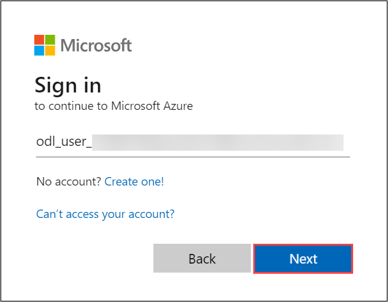

# Getting Started with Your Always On VPN guide

Welcome to your Always On VPN: Workshop

1. Once the environment is provisioned, a virtual machine and lab guide will get loaded into your browser. Use this virtual machine throughout the workshop to perform the lab.

## Accessing Your Lab Environment

Once you're ready to dive in, your virtual machine and lab guide will be right at your fingertips within your web browser.

.png)

### Virtual Machine & Lab Guide

Your virtual machine is your workhorse throughout the workshop. The lab guide is your roadmap to success.

## Exploring Your Lab Resources

To get a better understanding of your lab resources and credentials, navigate to the **Environment Details** tab.

## Utilizing the Split Window Feature

For convenience, you can open the lab guide in a separate window by selecting the **Split Window** button from the Top right corner.

   

## Managing Your Virtual Machine

Feel free to start, stop, or restart your virtual machine as needed from the **Resources** tab. Your experience is in your hands!

  

## **Lab Duration Extension**

1. To extend the duration of the lab, kindly click the **Hourglass** icon in the top right corner of the lab environment.

   

    >**Note:** You will get the **Hourglass** icon when 15 minutes are remaining in the lab.

2. Click **OK** to extend your lab duration.

   

3. If you have not extended the duration prior to when the lab is about to end, a pop-up will appear, giving you the option to extend. Click **OK** to proceed.

### Log in to Azure Portal and verify the pre-deployed resources

1. In the virtual machine (VM) on the left, click on the Azure Portal as shown below.

    

1. On **Sign in to Microsoft Azure** blade, you will see a login screen, in that enter the following email/username and then click on **Next**.
    * Email/Username: <inject key="AzureAdUserEmail"></inject>

     

1. Now enter the password and click on Sign in.
   * Password: <inject key="AzureAdUserPassword"></inject>
  
4. If a **Action Required** window appears, click on **Ask later**.

5. If prompted to stay signed in, you can click "No."

6. If a **Welcome to Microsoft Azure** pop-up window appears, simply click "Maybe Later" to skip the tour.

7. Click "Next" from the bottom right corner to embark on your Lab journey!

     .png)

Now you're all set to explore the powerful world of technology. Feel free to reach out if you have any questions along the way. Enjoy your workshop!
